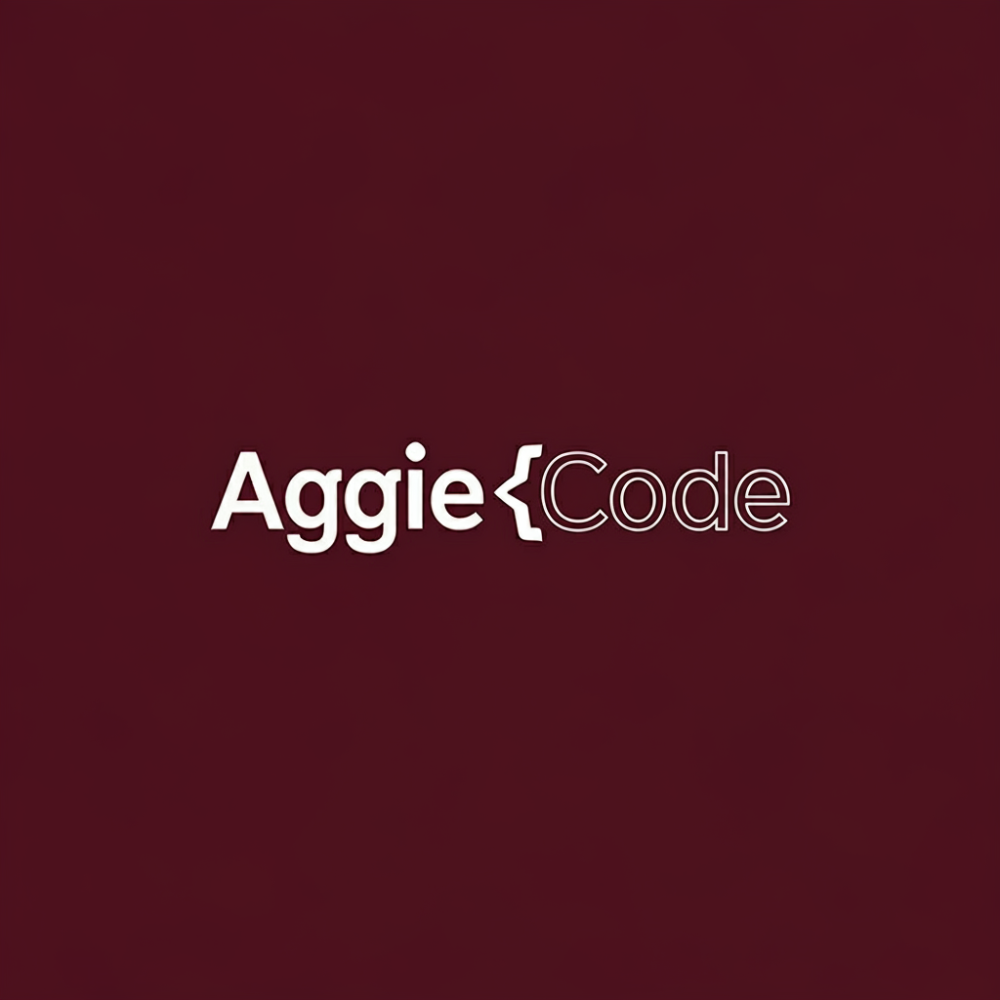

# AggieCode

# AggieCode: Real-time Collaborative IDE for Students

  

## Overview

AggieCode is a web-based, real-time collaborative Integrated Development Environment (IDE) specifically designed to enhance the learning experience for first-year engineering students engaged in team-based lab environments. It empowers students to collaboratively write, execute, and debug Python and C++ code while sharing outputs in real-time. AggieCode's intuitive interface, inspired by Visual Studio Code and powered by the Monaco Editor.

## Key Features

*   **Real-time Collaborative Coding:**
    *   Shared file editing with live cursor synchronization.
    *   Simultaneous code editing by multiple users.
*   **Multi-Language Support:**
    *   Code execution for Python, C++, and more.
    *   Shared output window visible to all collaborators.
*   **User-Friendly Interface:**
    *   Inspired by VS Code, providing a familiar and intuitive coding experience.
    *   Responsive design for seamless use on various devices.
*   **Secure Authentication:**
    *   Firebase Authentication for secure user login and session management.
*   **Efficient Backend:**
    *   Lightweight *Node.js (pending*) backend for code execution and synchronization.
    *   Optimized for fast response times and minimal resource usage.
*   **Demo-Ready:**
    *   Easily deployable for personal showcases, classroom demonstrations, and local development.
* **Theme Toggling**:
    * Light and Dark theme are available to provide the user a more personalized experience.

## Technology Stack

### Frontend

*   **Framework:** [Vue.js](https://vuejs.org/)
*   **UI Library:** [Vuetify](https://vuetifyjs.com/) (Material Design components)
*   **Code Editor:** [Monaco Editor](https://microsoft.github.io/monaco-editor/) (via [monaco-vue](https://www.npmjs.com/package/@guolao/vue-monaco-editor))
*   **State Management:** [Pinia](https://pinia.vuejs.org/)
*   **Styling:** [Tailwind CSS](https://tailwindcss.com/) (Optional, for rapid UI adjustments)
*   **Icons**: [Font Awesome](https://fontawesome.com/)

### Backend (WIP)

*   **Real-Time Collaboration:**
    *   [Y.js](https://github.com/yjs/yjs) (CRDT-based real-time state management)
    *   [y-websocket](https://github.com/yjs/y-websocket) (for document synchronization)
    *   [Socket.IO](https://socket.io/) (for auxiliary real-time events)
*   **Code Execution:**
    *   [Judge0 API](https://api.judge0.com/) (for server-side Python and C++ execution)
    *   [Py2Wasm](https://pyscript.net/) (Optional, for browser-based Python execution)
*   **Database:**
    *   [PostgreSQL](https://www.postgresql.org/) (for persistent storage)
    *   [Redis](https://redis.io/) (for in-memory caching)
*   **Authentication:** [Firebase Auth](https://firebase.google.com/docs/auth)

### Monitoring and Testing

*   **Error Tracking:** [Sentry](https://sentry.io/)
*   **Performance Monitoring:** [Prometheus](https://prometheus.io/) + [Grafana](https://grafana.com/)
*   **Frontend Testing:**
    *   [Cypress](https://www.cypress.io/) (for end-to-end testing)
    *   [Jest](https://jestjs.io/) (for unit testing)
*   **Backend Testing:**
    *   [Mocha](https://mochajs.org/) or [Jest](https://jestjs.io/) with [supertest](https://github.com/visionmedia/supertest) (for API testing)

## Project Roadmap

### Phase 1: Initial Setup (Completed)

*   ✅ Set up Vue.js project with Vuetify and Pinia.
*   ✅ Integrate Monaco Editor using `monaco-vue`.
*   ✅ Implement basic routing (login, IDE workspace).

### Phase 2: Collaboration (In Progress)

*   Integrate Y.js and `y-websocket` for real-time document synchronization.
*   Implement Socket.IO for real-time event broadcasting.
*   Develop collaborative editing features:
    *   Cursor highlighting.
    *   File sharing.

### Phase 3: Code Execution

*   Integrate Judge0 API for server-side code execution.
*   Design a shared output window.
*   (Pending) Explore Py2Wasm for client-side Python execution.

### Phase 4: Authentication & Session Management

*   Integrate Firebase Auth.
*   Implement session-based authentication and role management.
*   Enable joining specific lab sessions via session codes.

### Phase 5: Finalize UI & Testing

*   Refine UI using Vuetify.
*   Conduct comprehensive testing (real-time collaboration, edge cases).
*   Integrate Sentry for error tracking.

### Phase 6: Demo Preparation

*   Deploy the project (locally or cloud).
*   Prepare sample lab exercises.
*   Document demo flow and expected outcomes.

## Architecture (WIP)

### Frontend Components

*   **`FileExplorer.vue`:** Manages the file tree, allowing users to create, open, rename, and delete files.
*   **`CodeEditor.vue`:** The core Monaco Editor component for real-time collaborative coding.
*   **`OutputWindow.vue`:** Displays the output of code executed via Judge0.
*   **`CollaborationPanel.vue`:** Shows a list of online collaborators and their cursor positions.
*   **`Navbar.vue`:** Provides navigation, theme switching, and other global actions.

### Backend Architecture

*   **API Endpoints:**
    *   `POST /auth/login`: Handles user authentication via Firebase Auth.
    *   `GET /files/tree`: Retrieves the file structure for the current project.
    *   `POST /files/content`: Saves file content to the server (currently stored as text blobs in PostgreSQL for the demo).
    *   `POST /execute`: Sends code to Judge0 for execution and returns the results.
*   **WebSocket Events:**
    *   `cursor-update`: Broadcasts real-time cursor position changes to all collaborators in the same session.
    *   `file-update`: Synchronizes file content changes across all clients.
    *   `output-update`: Shares the output of code execution with all collaborators.

## Acknowledgements

*   [Vue.js](https://vuejs.org/)
*   [Vuetify](https://vuetifyjs.com/)
*   [Monaco Editor](https://microsoft.github.io/monaco-editor/)
*   [Y.js](https://github.com/yjs/yjs)
*   [Judge0 API](https://api.judge0.com/)
*   [Firebase](https://firebase.google.com/)

## License

This project is licensed under the MIT License - see the [LICENSE](LICENSE) file for details.
